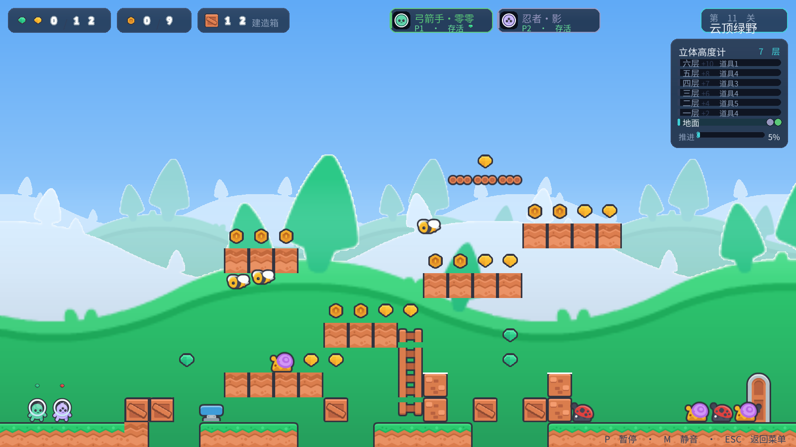
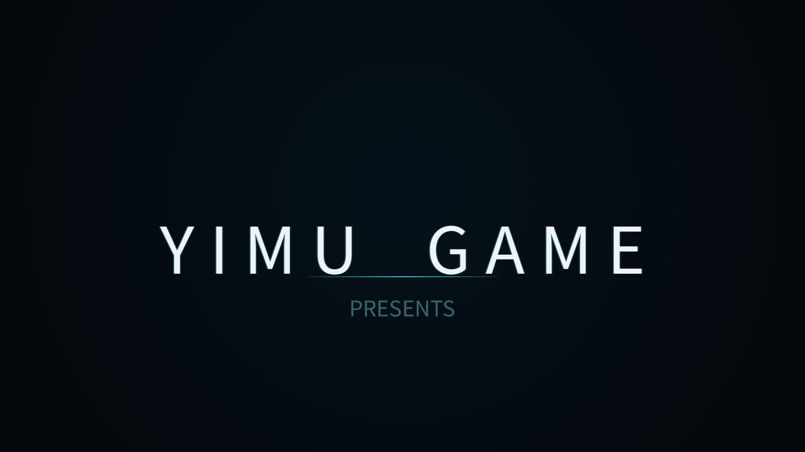
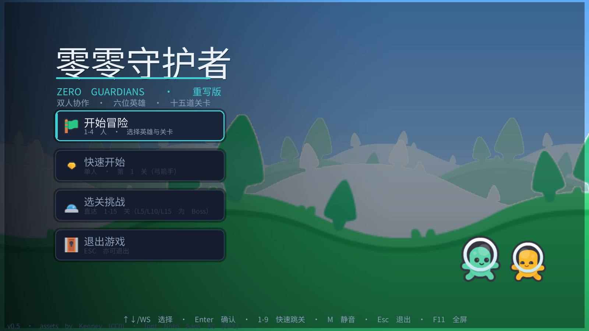
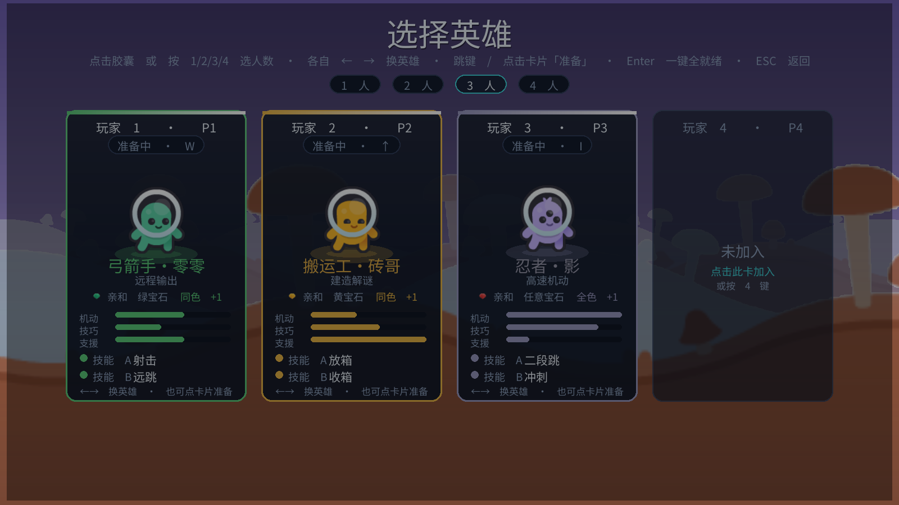
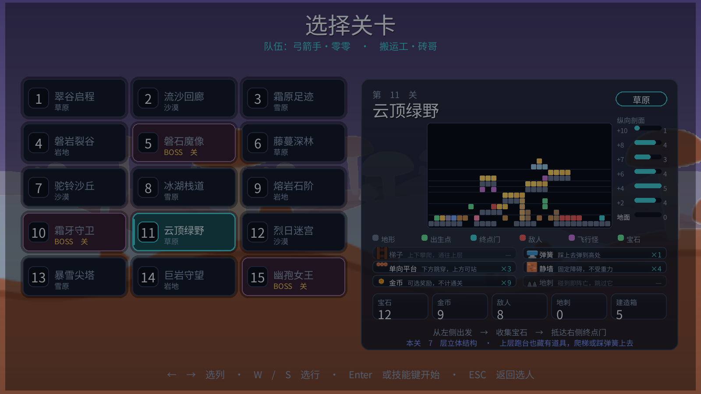
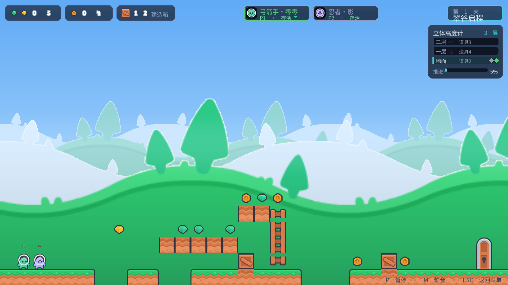
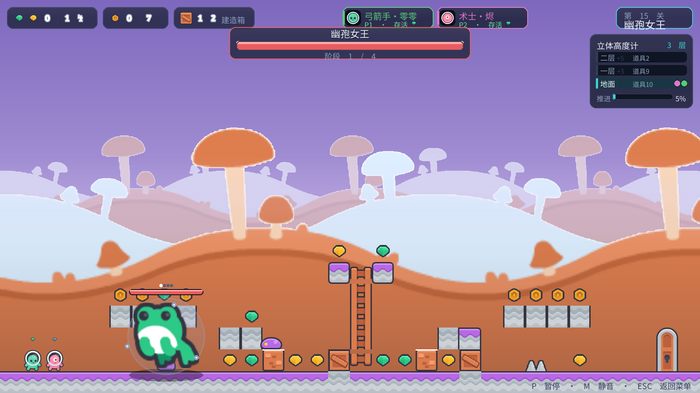
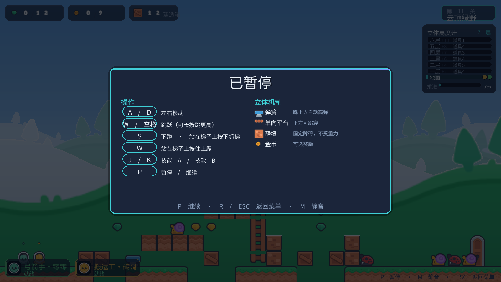

<div align="center">

# 零零守护者 · Zero Guardians

**1–4 人同屏协作 · 多层立体平台跳跃 · Pygame 企业级重写版**

[](https://www.python.org/)
[](https://www.pygame.org/)
[](#测试与自检)
[](#素材与许可)
[](LICENSE)

6 位英雄 × 2 技能 · 15 关 / 5 主题 · 3 场 Boss 战 · 1600×900 逻辑分辨率

</div>



## 这是什么

一款用 **Pygame** 从零重写的本地多人平台跳跃游戏。核心不是"能跑起来"，而是把平台跳跃里最容易含糊过去的三件事做扎实：

1. **物理是可复算的** —— 重力 1800、起跳初速 −684，于是单跳升高 ≈130px（2.6 格）、水平跳距 ≈197px（3.9 格）。
   所有关卡设计约束都从这两个数字反推出来，而不是"看着差不多行"。
2. **可达性是可验证的** —— 每颗宝石、每个金币都能被证明拿得到（站位 BFS + 梯子/弹簧固定点迭代 + 真实物理回放）。
3. **立体是多层的** —— 关卡不是一条平地上撒道具。地面 → 一层 → 二层 → 三层 → 顶层，
   道具、敌人、箱子都挂在各层上；梯子、弹簧、单向平台构成竖向交通。

界面同样是信息化的：HUD 有资源计数、**立体高度计**（逐层显示玩家在哪一层、离地多少格、该层有几件道具）、
关卡进度，以及带机制图例的开场横幅与暂停速查面板。

## 特性

### 玩法

| | |
| --- | --- |
| **1–4 人同屏协作** | 每人一套独立键位（或手柄），4 人默认键位互不占用同一区域；缺失的必填动作自动回填 |
| **6 英雄 × 2 技能 = 12 技能** | 弓箭手·零零（射击 / 远跳）· 搬运工·砖哥（放箱 / 收箱）· 忍者·影（二段跳 / 冲刺）· 门师·隙（布门 / 换门）· 术士·烬（悬停 / 冲击波）· 重锤·岩（重踏 / 举投） |
| **15 关 / 5 主题** | 草原 · 沙漠 · 雪原 · 岩地 · 菌林，各有独立天空、视差剪影与装饰植被 |
| **3 场 Boss 战** | 第 5 / 10 / 15 关：磐石魔像 · 霜牙守卫 · 幽孢女王，多阶段 + 召唤小怪 |
| **竖向交通** | 梯子（爬到顶左右一步即站上平台）· 弹簧（弹高 ≈7.3 格）· 单向平台（下方可跳穿、上方可站立） |
| **墙无重力** | 墙体是**静态瓦片**，用作障碍 / 掩体 / 支柱，永不坠落（有测试守护） |
| **手感调校** | 土狼时间 + 跳跃缓冲 + 可变跳高；重踏 AoE、冲击波、传送门等技能反馈 |

### 工程

- **src 布局**：`src/zero_brother/` 分 config / core / resources / input / scenes / systems / world / entities / heroes / levels
- **语义输入层**：逻辑代码只读 `Action` 枚举，永不读键码 —— 键位可配置、手柄支持、回放系统共用同一条链路
- **固定步长主循环**：逻辑按 1/60 秒定步结算，渲染带插值 alpha；场景栈切换，绝不递归重入
- **资源层**：路径大小写不敏感解析；字体一律用具体文件路径（不用 `SysFont`）；无音频设备静默降级
- **表现与逻辑解耦**：实体只 `world.emit("gem")`，由场景层消费事件队列播放音效
- **headless 可测**：所有渲染都有"无精灵回退图元"分支，CI 里没有显卡也能跑全量测试与截图

## 截图

| 启动动画 | 主菜单 |
| --- | --- |
|  |  |

| 角色选择（1–4 人） | 选关（含纵向剖面与机制图例） |
| --- | --- |
|  |  |

| 玩法：翠谷启程（入门 3 层） | 玩法：云顶绿野（满配 7 层） |
| --- | --- |
|  |  |

| Boss 战：幽孢女王 | 暂停面板（操作 + 机制速查） |
| --- | --- |
|  |  |

## 快速开始

```bash
git clone https://github.com/YLJ109/ZeroGuardians.git
cd ZeroGuardians

pip install -r requirements.txt          # pygame>=2.6, numpy>=1.24

python main.py                           # 窗口模式
python main.py --fullscreen              # 全屏
python main.py --headless --frames 600   # 无头冒烟（无需显示器）
```

> 关卡 JSON 位于 `data/levels/`，首次运行若缺失会自动生成（确定性种子，结果可复现）。
> 键位文件 `config/input.json` 同样首次运行自动创建。

**环境**：Python ≥ 3.11 · pygame 2.6 · numpy。Windows / macOS / Linux 均可（已按无显示环境做过全量验证）。

## 操作

| 动作 | P1 | P2 | P3 | P4 |
| --- | --- | --- | --- | --- |
| 左 / 右移动 | `A` / `D` | `←` / `→` | `J` / `L` | `小键盘 4` / `6` |
| 跳跃 | `W` | `↑` | `I` | `小键盘 8` |
| 下蹲 / 抓梯 | `S` | `↓` | `K` | `小键盘 5` |
| 技能 A / B | `J` / `K` | `1` / `2` | `U` / `O` | `小键盘 7` / `9` |

全局面板：`P` 暂停 · `M` 静音 · `ESC` 返回菜单。手柄热插拔自动识别。

## 关卡机制速查

| 元素 | 行为 |
| --- | --- |
| **梯子** | 站上去按「上 / 下」攀爬；爬到顶被钳制，左右一步即站上平台。梯子所在列在跑台上打孔 |
| **弹簧** | 落上去自动高弹（升高约 367px ≈ 7.3 格），可重复触发，左右走开即离开 |
| **单向平台** | 从上方可站立，从下方可跳穿；**不阻挡横向移动** |
| **静墙** | 固定障碍 / 掩体 / 支柱，不受重力，永不坠落 |
| **金币** | 可选奖励，不计入通关判定 |
| **地刺** | 碰到即阵亡，需绕开或跳过 |
| **终点门** | 集齐全部宝石 + 击败 Boss 后才开启 |

## 项目结构

```
ZeroGuardians/
├── main.py                      # 入口（--fullscreen / --headless --frames N）
├── src/zero_brother/
│   ├── config/                  # 集中配置（物理常量、渲染尺寸、玩法参数）
│   ├── core/                    # 固定步长循环、场景栈、App、letterbox
│   ├── input/                   # Action 枚举 · 键位映射 · 手柄读取 · 事件广播
│   ├── resources/               # 路径解析 + 许可清单
│   ├── ui/theme.py              # 统一 UI 构件（面板 / 玻璃 / 按钮 / 渐变 / 视差背景）
│   ├── scenes/                  # splash · menu · select · gameplay
│   ├── world/                   # tilemap · level + level_facts · world · sprites
│   ├── entities/                # player · monster · boss · box · portal · bullet
│   ├── heroes/                  # 英雄注册表 + 12 个技能实现
│   └── levels/generate.py       # 多层立体关卡生成器
├── assets/vendor/               # Kenney CC0 素材 + Noto Sans SC（OFL）
├── data/levels/                 # 15 关 JSON（可复现生成）
├── docs/                        # GDD、素材说明、README 截图
├── prototypes/                  # 启动动画风格原型
├── tests/                       # tests/run.py 一键跑（不依赖 pytest）
└── tools/                       # render_check.py · build_font_subset.py
```

## 测试与自检

```bash
python tests/run.py                                            # 66 项断言
SDL_VIDEODRIVER=dummy python tools/render_check.py             # 全量场景截图自检
SDL_VIDEODRIVER=dummy python tools/render_check.py --readme --out docs/screenshots
```

测试覆盖的重点不是"函数能调用"，而是**设计约束本身**：

- **关卡结构**：缺口 ≤3 格、门前净空、出生净空、要素不重叠、难度曲线单调、生成确定性
- **可达性**：站位 BFS（`tests/test_verticality.py`）证明每颗宝石 / 每个金币可达，没有"看得见拿不到"
- **真实物理回放**：单跳跨越 2 行台阶、上穿单向平台、爬梯登上平台、弹簧弹得比普通跳高、坠坑死亡并重生
- **静态结构**：墙 / 梯 / 弹簧 / 单向平台跑 300 帧后网格逐字节不变
- **契约**：`level_facts` 的层序与道具归属、音频名全部能解析到真实文件、默认字体为已登记 OFL 且中文字宽等宽

## 关卡设计硬约束（改生成器前先看）

| 约束 | 数值 | 来源 |
| --- | --- | --- |
| 单跳升高 | ≈130px（2.6 格） | `GRAVITY=1800`, `JUMP_VELOCITY=-684` |
| 水平跳距 | ≈197px（3.9 格） | 同上 + `MOVE_SPEED` |
| 台阶高差上限 | ≤2 行（100px） | 单跳升高反推 |
| 地面缺口上限 | ≤3 格 | 水平跳距反推 |
| ≥3 行高差 | 必须用梯子 / 弹簧连接 | 否则不可达 |
| 死空间 | 玩家高 56px，站 row17 时头顶到 row15 | 上层跑台正下方不放任何道具 |

**对角线阶梯**是保证可达性的构造：相邻跑台横向错开 1 列、抬高 2 行 —— 站在这层右端跑过去起跳，
落点必然在上一层最左端。所有必收集的宝石都挂在这条链上或其上方 1–2 行。

## 素材与许可

**代码以 [MIT](LICENSE) 授权。随包素材各自遵循其原始许可，与 MIT 相互独立：**

| 路径 | 内容 | 许可 |
| --- | --- | --- |
| `assets/vendor/kenney_new_platformer/` | 角色 / 敌人 / 地形 / 道具 / 背景 / 音效 | **CC0 1.0**（[Kenney.nl](https://kenney.nl/)） |
| `assets/vendor/kenney_interface_sounds/` | UI 音效 | **CC0 1.0** |
| `assets/vendor/noto_sans_sc/` | Noto Sans SC 中文子集（862KB / 3,964 字） | **SIL OFL 1.1** |

完整清单与再分发注意事项见 [`THIRD_PARTY_NOTICES.md`](THIRD_PARTY_NOTICES.md)。

仓库不包含任何来源不明或许可未确认的素材：
旧工程素材（`assets/img`、`wav`、`video`、`font`，来源不明 / 非 OFL 字体）已在 `.gitignore` 中排除，
渲染层也完全不引用它们。子集字体可用 `tools/build_font_subset.py` 复现。

## 文档

- [`docs/GDD.md`](docs/GDD.md) — 游戏设计文档（数值、关卡原则、验收标准）
- [`docs/ASSETS_EXTERNAL.md`](docs/ASSETS_EXTERNAL.md) — 外部素材来源、许可与获取通道
- [`docs/ASSETS.md`](docs/ASSETS.md) — 素材清单与替换记录
- [`THIRD_PARTY_NOTICES.md`](THIRD_PARTY_NOTICES.md) — 第三方素材许可汇总

---

<div align="center"><sub>零零守护者 · Zero Guardians — 用可验证的方式做平台跳跃。</sub></div>
